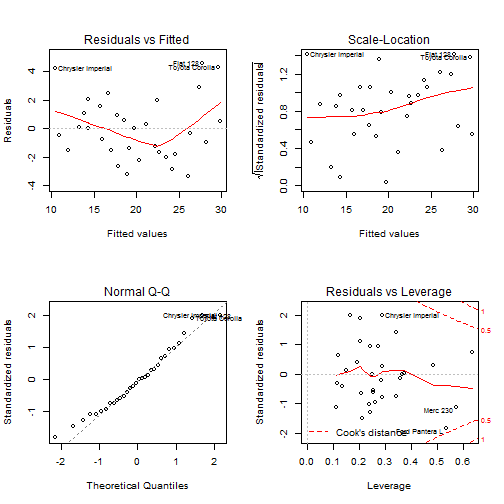

## Linear regression - exercise 
# Developing data products - projects

The main purpose of she presentation is to show steps of fitting linear model.
The analysis is prepared on _mtcars_ dataset showed on the second slide and the depending variable is _mpg_. The following slides consists of:
- plot with influence of combination of dependent variables on R2
- formula od chosen model - with variables that implies the highest R2 + estimated coefficients
- plots that help to asses goodless of fit to real data

--- .class #id 

## mtcars dataset table


```
Error in library("leaps"): there is no package called 'leaps'
```

```
                     mpg cyl  disp  hp drat    wt  qsec vs am gear carb
Mazda RX4           21.0   6 160.0 110 3.90 2.620 16.46  0  1    4    4
Mazda RX4 Wag       21.0   6 160.0 110 3.90 2.875 17.02  0  1    4    4
Datsun 710          22.8   4 108.0  93 3.85 2.320 18.61  1  1    4    1
Hornet 4 Drive      21.4   6 258.0 110 3.08 3.215 19.44  1  0    3    1
Hornet Sportabout   18.7   8 360.0 175 3.15 3.440 17.02  0  0    3    2
Valiant             18.1   6 225.0 105 2.76 3.460 20.22  1  0    3    1
Duster 360          14.3   8 360.0 245 3.21 3.570 15.84  0  0    3    4
Merc 240D           24.4   4 146.7  62 3.69 3.190 20.00  1  0    4    2
Merc 230            22.8   4 140.8  95 3.92 3.150 22.90  1  0    4    2
Merc 280            19.2   6 167.6 123 3.92 3.440 18.30  1  0    4    4
Merc 280C           17.8   6 167.6 123 3.92 3.440 18.90  1  0    4    4
Merc 450SE          16.4   8 275.8 180 3.07 4.070 17.40  0  0    3    3
Merc 450SL          17.3   8 275.8 180 3.07 3.730 17.60  0  0    3    3
Merc 450SLC         15.2   8 275.8 180 3.07 3.780 18.00  0  0    3    3
Cadillac Fleetwood  10.4   8 472.0 205 2.93 5.250 17.98  0  0    3    4
Lincoln Continental 10.4   8 460.0 215 3.00 5.424 17.82  0  0    3    4
```

---

## Variable Selection


```r
leaps<-regsubsets(mpg ~ ., data=dataset,nbest=10)
```

```
## Error in eval(expr, envir, enclos): nie uda³o siê znaleŸæ funkcji 'regsubsets'
```

```r
plot(leaps,scale="r2")
```

```
## Error in plot(leaps, scale = "r2"): nie znaleziono obiektu 'leaps'
```

---

## Linear model estimation


```
lm(formula = mpg ~ disp + hp + drat + wt + qsec + am + gear + 
    carb, data = dataset)
```

```
(Intercept)        disp          hp        drat          wt        qsec 
 9.76827789  0.01214441 -0.02095020  0.87509822 -3.71151106  0.91082822 
         am        gear        carb 
 2.52390094  0.75984464 -0.24796312 
```

---

## Goodness of fit

 

